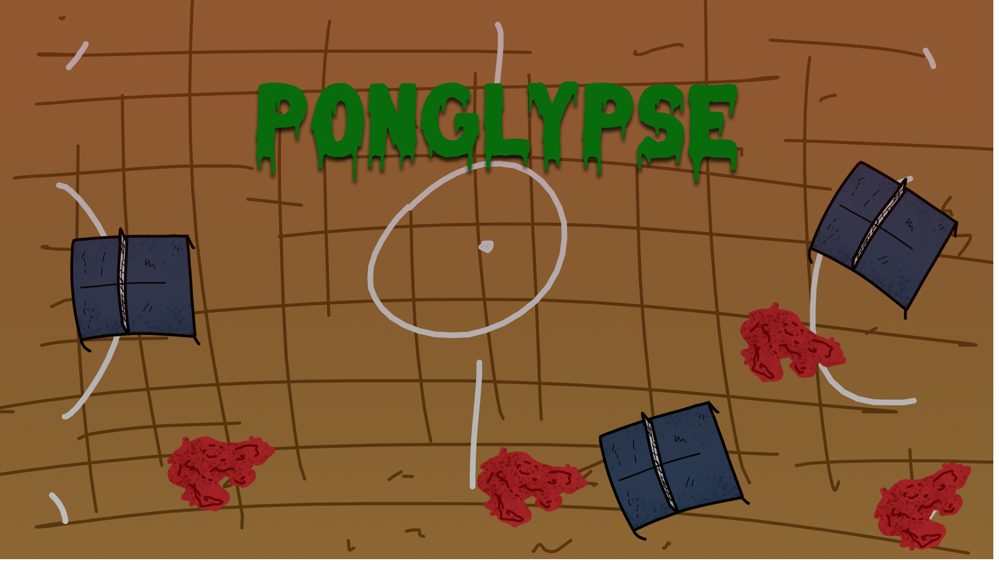

# ponglypse

  

 

  
Table of Contents

  <ul>
    <li><a href="#-about-the-game"> About the game</a></li>
    <li><a href="#-how-to-play"> How to play</a></li>
    <li><a href="#-game-design"> Game design</a></li>
    <li><a href="#-game-development"> Game development</a></li>
    <li><a href="#-credits"> Credits</a></li>
  </ul>

 
<h2 id="#about-the-game"> About the game</h2>
A simple survival game where you need to use your ping-pong skills to keep moving through tons of zombies.
 
<h2 id="#how-to-play"> How to play</h2>
Play here: https://giovanemachado.itch.io/ponglypse 
Controls: 

- W-A-S-D to move
- Click to spawn a ball if you don't have one (the ball lasts while its hitting stuff)
- Click to hit the ball with your paddle (in the direction your mouse points)
- Right-click to respawn the ball (you can't respawn the ball every time, there is a delay)
 
<h2 id="#game-design"> Game design</h2>
Inspired by the classic pong games, I tried to achieve in this game a fun experience with the ball hitting zombies and stuff, while you still need to time and think your paddle hits to keep the momentum.
 
<h2 id="#game-development"> Game development</h2>
The code follows a pattern I'm working on, with a single class per scene commanding all awakes, starts and updates. It uses composition almost everywhere to keep the code in its own classes. It's worth saying that was created in just 7 days, including the art. Created for PongJam 2022 https://itch.io/jam/pongjam
 
<h2 id="#credits"> Credits</h2>
<a href="https://github.com/giovanemachado"> Giovane Machado</a> - game design, game development and game art. 
Music and sounds from Youtube Library
 
